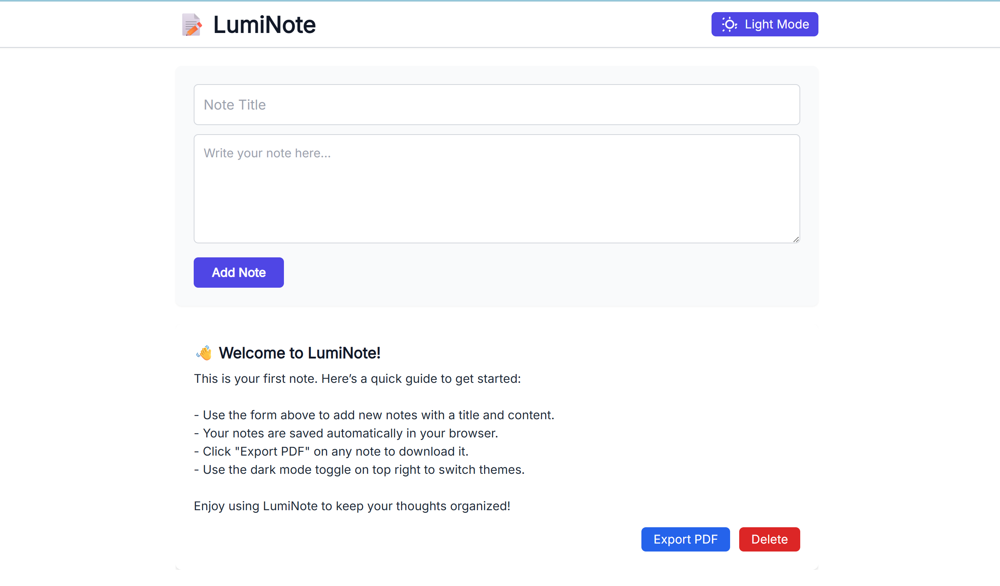

# ✨ LumiNote

A sleek, distraction-free **note-taking web app** with a modern MS Word–like UI, **PDF export**, **offline access**, and plans for **authentication and cloud sync**. Built by **Lucky Joshi** under the **LuminAI** banner.

[🌐 Live Demo](https://luminote.netlify.app) | [📂 GitHub Repo](https://github.com/Lucky-Joshi/LumiNote)

---

## 📖 Overview

**LumiNote** is a smart and minimal web-based notepad designed for simplicity, productivity, and portability. With offline-first support and a user-friendly layout, it's your go-to tool for quick notes, to-dos, or even long-form writing.

---

## 🚀 Features

- ✅ Create, view, and delete notes
- 🌗 **Dark / Light Mode** toggle (with memory)
- 📄 **Export notes to PDF** (via jsPDF)
- 💾 **Auto-save** using localStorage
- 🧠 Preloaded **Welcome Note & Guide**
- 🖥️ MS Word–like responsive UI
- 📶 Fully **Offline Usable**

---

## 🔐 Upcoming Features (Planned)

- Firebase **Authentication** (Sign Up / Login)
- **Cloud syncing** of notes via Firestore
- **Rich Text Editing** (Bold, Italics, Headings, etc.)
- PWA installation (Add to Home Screen)
- Shared & Collaborative Notes

---

## 🌍 Live Website

[🔗 https://luminote.netlify.app](https://luminote.netlify.app)

---

## 🧪 How to Use

1. ✍️ Enter a **note title** and **content**
2. ✅ Click **"Create Note"**
3. 📁 View your notes below the editor
4. 🗑 Delete notes when needed
5. 📄 Click **Export PDF** to download your note
6. 🌙 Use the **toggle** to switch themes
7. 💡 A **Welcome Note** appears for new users

---

## 🛠️ Tech Stack

- **HTML5**
- **Tailwind CSS**
- **Vanilla JavaScript**
- **jsPDF** for PDF exporting

---

## 🧠 Built-in Welcome Note

When users first load LumiNote, a **built-in note** appears that:

- Welcomes the user
- Describes how to use the app
- Offers a simple user guide
- Encourages productivity and clarity

---

## 🛡️ License

© 2025 **LuminAI** — All rights reserved.

**LumiNote** is a proprietary product developed and owned by **LuminAI**, founded by [Lucky Joshi](https://github.com/Lucky-Joshi).

- You **may use** this software for personal, non-commercial purposes.
- You **may NOT** copy, modify, distribute, or sell this software or any part of it without explicit written permission from **LuminAI**.
- Unauthorized use or distribution is strictly prohibited.

For inquiries or licensing requests, please contact: [luckyjoshi524@gmail.com](mailto:luckyjoshi524@gmail.com)

See the full license details in the [`LICENSE`](./LICENSE) file.
